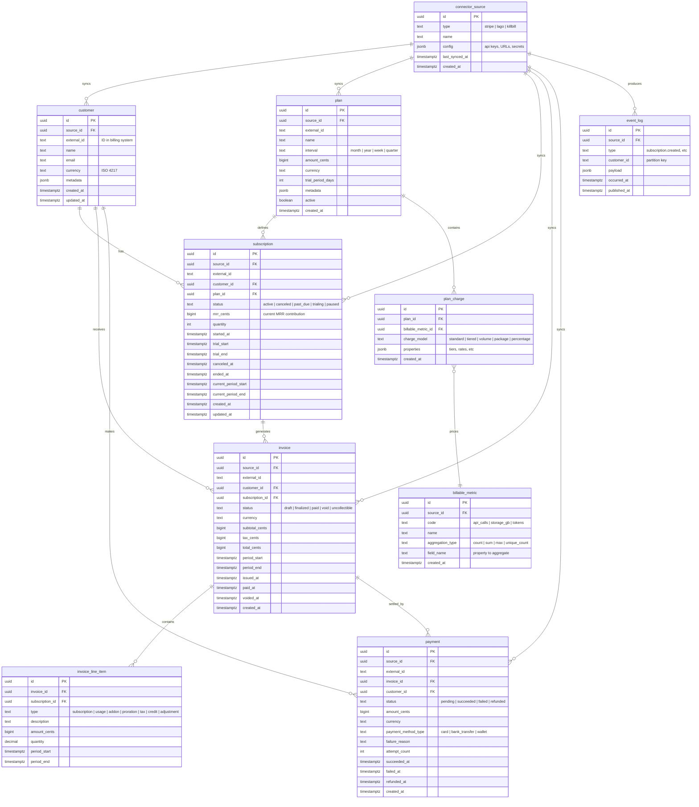

# Database

> Core schema, ER diagram, and rationale for PostgreSQL.
> Last updated: March 2026

## Why PostgreSQL (not ClickHouse)

ClickHouse excels at columnar analytics over billions of rows. But subscription analytics has different characteristics:

| Factor | Subscription Analytics | Implication |
|--------|----------------------|-------------|
| Data volume | Thousands-low millions of rows | PostgreSQL handles this comfortably |
| Write pattern | Frequent upserts from event processing | PostgreSQL's MVCC handles upserts natively; ClickHouse has eventual consistency with ReplacingMergeTree |
| Relationships | Deep: customer -> subscription -> invoice -> line items -> payments | PostgreSQL enforces referential integrity; ClickHouse has no foreign keys |
| Query pattern | JOINs across 4-5 tables for metric computation | PostgreSQL's query planner is built for this; ClickHouse JOINs are limited |
| Deployment | Self-hosted simplicity matters | PostgreSQL is the most widely deployed database; ClickHouse needs more operational expertise |

**Decision:** PostgreSQL as the single database. If a user later needs to feed a data warehouse, the metrics package can export to any target.

## Schema Ownership

The database has two categories of tables:

1. **Core tables** — managed by the framework. Store current state of billing entities and the event log. Defined below.
2. **Metric plugin tables** — each [metric plugin](metrics.md) owns its own tables (prefixed `metric_`). Created by the plugin's `register_tables()` method. See individual plugin docs in [Metrics](metrics.md).

This separation means adding a new metric never touches core schema.

## Entity-Relationship Diagram (Core Tables)



## Metric Plugin Tables

Each metric plugin creates its own tables, prefixed with `metric_`. These are documented in [Metrics](metrics.md). Summary:

| Plugin | Tables | Purpose |
|--------|--------|---------|
| MRR | `metric_mrr_snapshot`, `metric_mrr_movement` | Current MRR per subscription, MRR change log |
| Churn | `metric_churn_customer_state`, `metric_churn_event` | Customer activity tracking, churn events |
| Retention | `metric_retention_cohort`, `metric_retention_activity` | Cohort membership, monthly activity |
| LTV | `metric_ltv_customer_revenue` | Cumulative revenue per customer |
| Trials | `metric_trial_event` | Trial lifecycle events |

## Event Log

The `event_log` table is a permanent archive of all [internal events](events.md). It serves two purposes:

1. **Replay source** — when Kafka retention expires or when bootstrapping a new deployment
2. **Audit trail** — full history of every billing system change

Events are append-only. The table is never updated or deleted from.

## Indexes

Key indexes beyond primary keys:

```sql
-- Unique billing system IDs
CREATE UNIQUE INDEX ix_customer_source ON customer(source_id, external_id);
CREATE UNIQUE INDEX ix_subscription_source ON subscription(source_id, external_id);
CREATE UNIQUE INDEX ix_invoice_source ON invoice(source_id, external_id);
CREATE UNIQUE INDEX ix_payment_source ON payment(source_id, external_id);

-- Event log queries
CREATE INDEX ix_event_log_type_time ON event_log(type, occurred_at);
CREATE INDEX ix_event_log_customer ON event_log(customer_id, occurred_at);

-- State queries
CREATE INDEX ix_subscription_status ON subscription(status, customer_id);
CREATE INDEX ix_invoice_period ON invoice(period_start, period_end, status);
CREATE INDEX ix_payment_status ON payment(status, created_at);

-- Cohort queries
CREATE INDEX ix_customer_created ON customer(created_at);
```

## Money Handling

All monetary values are stored as **cents (bigint)**. This avoids floating-point precision issues. The metrics package converts to decimal at the query boundary.

- `mrr_cents = 4999` means $49.99/month
- Annual plan at $599/year: `mrr_cents = 59900 / 12 = 4991` (integer division, round down)
- Multi-currency: each record stores its `currency`. Cross-currency aggregation is the consumer's responsibility.
